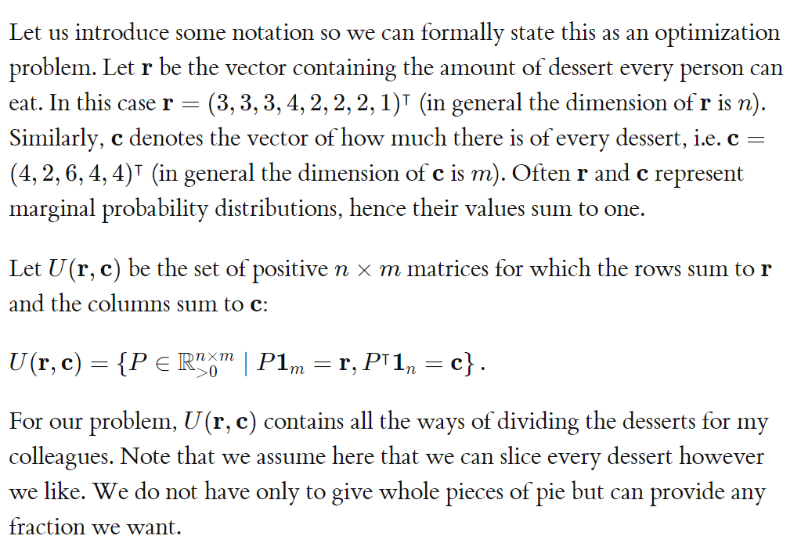
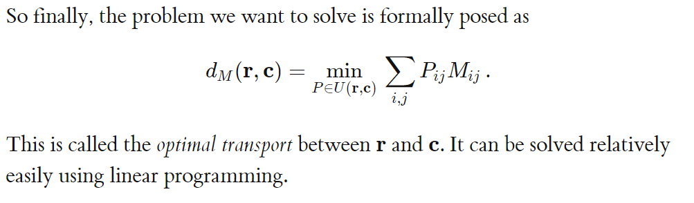
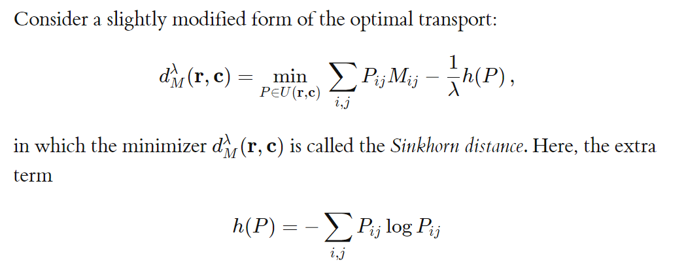

### 1. Sinkhorn distance

sinkhorn 要解决的问题就是以最小代价将一个概率分布转换为另外一个分布，其中问题可表示为：

尤其值得注意的是，其中*d*M被称为Wasserstein metric,是两个概率分布之间一个基础的距离表示。
进而我们对问题添加正则项，更合理的这种距离被称为Sinkhorn距离

Reference：https://michielstock.github.io/posts/2017/2017-11-5-OptimalTransport/